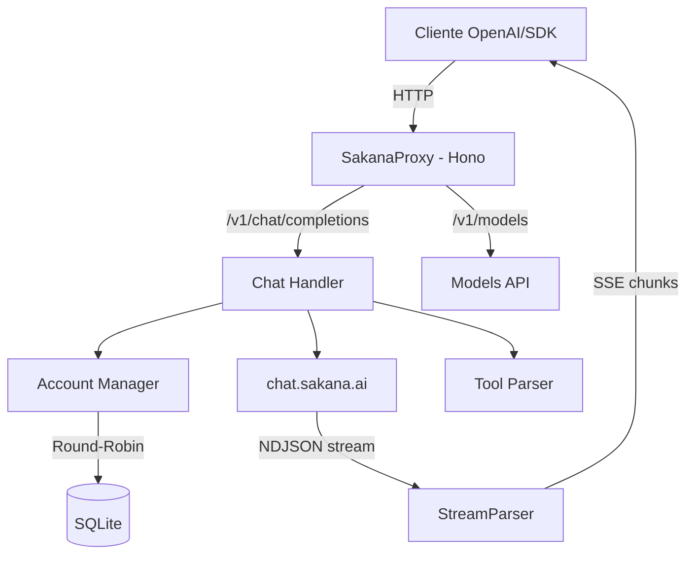

# SakanaProxy v2

Proxy API local compatível com OpenAI que roteia requisições para o **Sakana Chat (chat.sakana.ai)** usando cookies de sessão. Suporte a múltiplas contas com rotação automática, streaming NDJSON→SSE, modo de pensamento (reasoning), execução de ferramentas e armazenamento em SQLite.

[](https://www.typescriptlang.org/)
[](https://hono.dev/)
[](https://nodejs.org/)
[](LICENSE)

---

## Features

- **OpenAI API Compatible** — Interface compatível com `/v1/chat/completions`, `/v1/models`, `/v1/chat/completions/stop`.
- **Multi-Account** — Gerencie múltiplos cookies de sessão Sakana com rotação round-robin e cooldown automático.
- **No Browser Automation** — Ao contrário do qwenproxy, o Sakana Chat só exige um cookie de sessão (`sakana-chat=UUID`); não é necessário Playwright/Selenium.
- **SQLite Storage** — Cookies criptografados em repouso (AES-256-GCM) e salvos em SQLite (WAL mode).
- **Reasoning Support** — Suporte completo ao modo de pensamento do Namazu.
- **Streaming** — Conversão do NDJSON do Sakana para o formato SSE do OpenAI.
- **Tool Execution** — Sistema de execução de ferramentas locais integrado ao fluxo do chat (formato `<tool_call>`).
- **Session Validation** — Validação de cookies na inicialização via `/api/user`.
- **Monitoring** — Health check, métricas Prometheus e watchdog integrados.
- **CLI Manager** — Gerenciador interativo de contas via `npm run login`.
- **Docker Ready** — Deploy para VPS com Docker e graceful shutdown.

---

## Arquitetura



### Diferenças em relação ao qwenproxy

| Aspecto | qwenproxy | sakanaproxy |
|---------|-----------|-------------|
| Alvo | chat.qwen.ai | chat.sakana.ai |
| Autenticação | Email + senha + anti-bot headers (bx-ua, bx-v, bx-umidtoken) | Apenas cookie `sakana-chat=UUID` |
| Browser automation | Playwright (necessário) | **Não necessário** |
| Captcha | TMD/Baxia solver | Não há |
| Stream upstream | SSE com `phase: thinking_summary` | NDJSON com `{"type":"stream","token":"..."}` |
| Anti-side-channel | Não | Sim (tokens padded com `\u0000`) — já tratado pelo parser |
| Modelos | Vários (qwen-plus, qwen3.7-plus, etc.) | `sakana/namazu-v6.3` (único) |
| Persistência | SQLite + perfis de navegador | Apenas SQLite |

---

## Pré-requisitos

| Dependência | Versão Mínima | Instalação |
|------------|--------------|-----------|
| Node.js | v20.x | [nvm](https://github.com/nvm-sh/nvm) |
| npm | v9.x | Incluído com Node.js |
| Docker (opcional) | v24.x | [Docker Docs](https://docs.docker.com/get-docker/) |

---

## Instalação

### Via git (Local)

```bash
git clone https://github.com/kardeiro/sakanaproxy-v2.git
cd sakanaproxy-v2
npm install
```

### Via Docker

```bash
docker-compose up -d
```

---

## Configuração

Crie o arquivo `.env` na raiz do projeto (veja `.env.example`):

```env
# Porta do servidor (default: 3000)
PORT=3000

# Host do servidor (default: 0.0.0.0)
HOST=0.0.0.0

# Chave de API para proteger os endpoints (opcional)
# Se vazio, nenhuma autenticação é exigida nas rotas /v1/*
API_KEY=

# Modelo padrão do Sakana Chat (default: sakana/namazu-v6.3)
SAKANA_DEFAULT_MODEL=sakana/namazu-v6.3

# Timeouts (milissegundos)
HTTP_TIMEOUT=60000
CHAT_TIMEOUT=180000
STREAM_IDLE_TIMEOUT=180000

# Habilitar coleta de métricas Prometheus
METRICS_ENABLED=true

# Habilitar log detalhado (debug | info | warn | error)
LOG_LEVEL=info
```

---

## Como obter o cookie `sakana-chat`

O Sakana Chat autentica via um único cookie HTTP chamado `sakana-chat`. Para obtê-lo:

1. Acesse https://chat.sakana.ai/ no navegador e faça login (Google ou email).
2. Abra as DevTools (`F12`) → aba **Application** → **Cookies** → `https://chat.sakana.ai`.
3. Localize o cookie `sakana-chat` e copie seu valor (um UUID, ex.: `a1b2c3d4-e5f6-7890-abcd-ef1234567890`).

> **Dica**: Você também pode exportar todos os cookies via uma extensão como *EditThisCookie* (formato JSON) — o SakanaProxy detecta automaticamente a entrada `name="sakana-chat"`.

---

## Gerenciamento de Contas

As contas são armazenadas em SQLite (`data/sakanaproxy.db`) com o cookie **criptografado em repouso** (AES-256-GCM). Use o CLI interativo para gerenciar:

```bash
npm run login
```

O menu interativo permite:

- **[A]** Adicionar conta (colar cookie `sakana-chat`)
- **[L]** Listar contas
- **[R]** Remover uma conta
- **[T]** Testar uma conta (chama `/api/user` para validar o cookie)
- **[Q]** Sair

Formas aceitas de colar o cookie:

- Valor puro (UUID): `a1b2c3d4-e5f6-7890-abcd-ef1234567890`
- Cookie header completo: `sakana-chat=UUID; Path=/; Secure; HttpOnly`
- Array JSON exportado de extensão de browser (deve conter uma entrada com `name="sakana-chat"`)

---

## Uso

### Iniciar o servidor

```bash
npm start
```

O servidor inicia em `http://localhost:3000` com as seguintes rotas:

| Rota | Método | Descrição |
|------|--------|-----------|
| `/v1/chat/completions` | POST | Chat completions (streaming + non-streaming) |
| `/v1/chat/completions/stop` | POST | Abortar uma geração ativa |
| `/v1/models` | GET | Listar modelos disponíveis |
| `/v1/models/:model` | GET | Informações de um modelo específico |
| `/v1/accounts` | GET | Listar contas configuradas (cookies redacted) |
| `/health` | GET | Health check com status do sistema |
| `/metrics` | GET | Métricas no formato Prometheus |

---

## Exemplos de Integração

### OpenAI SDK (Node.js)

```typescript
import OpenAI from 'openai'

const openai = new OpenAI({
  baseURL: 'http://localhost:3000/v1',
  apiKey: process.env.API_KEY || 'sk-no-key-required',
})

const completion = await openai.chat.completions.create({
  model: 'sakana/namazu-v6.3',
  messages: [{ role: 'user', content: 'Explique o que é a Sakana AI.' }],
})

console.log(completion.choices[0].message.content)
```

### Streaming

```typescript
const stream = await openai.chat.completions.create({
  model: 'sakana/namazu-v6.3',
  messages: [{ role: 'user', content: 'Conte uma história curta sobre um peixe.' }],
  stream: true,
})

for await (const chunk of stream) {
  const content = chunk.choices[0]?.delta?.content || ''
  process.stdout.write(content)
}
```

### Modo "No Thinking" (sem reasoning)

```typescript
const completion = await openai.chat.completions.create({
  model: 'sakana/namazu-v6.3-no-thinking',  // sufixo -no-thinking desabilita reasoning
  messages: [{ role: 'user', content: 'Quanto é 2+2?' }],
})
```

### Tool Calling

```typescript
const completion = await openai.chat.completions.create({
  model: 'sakana/namazu-v6.3',
  messages: [
    { role: 'user', content: 'Qual é a previsão do tempo em Tóquio?' }
  ],
  tools: [{
    type: 'function',
    function: {
      name: 'get_weather',
      description: 'Obtém a previsão do tempo para uma cidade',
      parameters: {
        type: 'object',
        properties: {
          city: { type: 'string', description: 'Nome da cidade' }
        },
        required: ['city']
      }
    }
  }],
})

const toolCall = completion.choices[0].message.tool_calls?.[0]
if (toolCall) {
  console.log(`Tool: ${toolCall.function.name}`)
  console.log(`Args: ${toolCall.function.arguments}`)
}
```

### cURL

```bash
curl http://localhost:3000/v1/chat/completions \
  -H "Content-Type: application/json" \
  -H "Authorization: Bearer sua-chave" \
  -d '{
    "model": "sakana/namazu-v6.3",
    "messages": [{"role": "user", "content": "Hello!"}],
    "stream": true
  }'
```

---

## Deploy com Docker

### docker-compose.yml

```yaml
services:
  sakanaproxy:
    build: .
    container_name: sakanaproxy
    ports:
      - "${PORT:-3000}:3000"
    env_file:
      - .env
    volumes:
      - ./data:/app/data
    restart: unless-stopped
    logging:
      driver: "json-file"
      options:
        max-size: "10m"
        max-file: "3"
```

### Volumes persistentes

| Volume | Conteúdo |
|--------|----------|
| `./data` | Banco SQLite com as contas (`sakanaproxy.db`) |

> Após subir o container, execute `npm run login` dentro dele para adicionar contas:
>
> ```bash
> docker exec -it sakanaproxy npx tsx src/login.ts
> ```

---

## Estrutura do Projeto

```
sakanaproxy-v2/
├── bin/
│   └── sakanaproxy.mjs          # Entry point do CLI binário
├── src/
│   ├── index.ts                 # Entry point do servidor
│   ├── login.ts                 # CLI de gerenciamento de contas
│   ├── api/
│   │   └── server.ts            # Servidor Hono + startup
│   ├── cache/
│   │   └── memory-cache.ts      # Cache em memória com TTL
│   ├── core/
│   │   ├── account-manager.ts   # Rotação round-robin + cooldowns
│   │   ├── accounts.ts          # CRUD de contas (SQLite)
│   │   ├── config.ts            # Configuração com Zod
│   │   ├── crypto-utils.ts      # Criptografia AES-256-GCM de cookies
│   │   ├── database.ts          # Conexão e migrations SQLite
│   │   ├── logger.ts            # Logger estruturado
│   │   ├── metrics.ts           # Coleta de métricas Prometheus
│   │   ├── model-registry.ts    # Registro de modelos
│   │   ├── stream-registry.ts   # Tracking de streams ativos
│   │   └── watchdog.ts          # Health monitoring
│   ├── routes/
│   │   ├── chat.ts              # Handler /v1/chat/completions
│   │   ├── models.ts            # Endpoints /v1/models
│   │   └── stream-handler.ts    # Orquestração de streaming SSE
│   ├── services/
│   │   ├── sakana.ts            # Cliente HTTP do chat.sakana.ai
│   │   └── sakana-stream-parser.ts # Parser do NDJSON do Sakana
│   ├── tools/
│   │   ├── parser.ts            # Parser de <tool_call> tags
│   │   ├── registry.ts          # Registro de tools
│   │   ├── schema.ts            # Validação JSON Schema
│   │   └── types.ts             # Tipos do sistema de tools
│   └── utils/
│       ├── context-truncation.ts # Truncamento de contexto
│       ├── json.ts              # Parser JSON robusto
│       └── types.ts             # Tipos OpenAI
├── data/                        # Banco SQLite (gitignored)
├── Dockerfile
├── docker-compose.yml
├── tsconfig.json
├── tsconfig.build.json
└── package.json
```

---

## Endpoints internos do Sakana Chat

O SakanaProxy usa os seguintes endpoints internos do chat.sakana.ai (que é um fork do [huggingface/chat-ui](https://github.com/huggingface/chat-ui)):

| Endpoint | Método | Descrição |
|----------|--------|-----------|
| `/api/user` | GET | Dados do usuário (validação de cookie) |
| `/api/conversations` | GET | Lista conversas |
| `/api/v2/conversations/{id}` | GET | Conversa completa com mensagens |
| `/api/v2/user/settings` | GET | Settings do usuário |
| `/conversation` | POST | Cria nova conversa (`{"model":"sakana/namazu-v6.3"}`) |
| `/conversation/{id}` | POST | Envia mensagem (multipart/form-data com campo `data` = JSON) → stream NDJSON |
| `/conversation/{id}/stop-generating` | POST | Para geração |
| `/conversation/{id}` | DELETE | Deleta conversa |

### Formato do stream NDJSON

Cada linha é um JSON terminado por `\n`:

```json
{"type":"createdMessage","messageId":"..."}
{"type":"status","status":"keepAlive"}
{"type":"status","status":"started"}
{"type":"stream","token":"T\u0000\u0000\u0000\u0000\u0000\u0000\u0000\u0000\u0000\u0000\u0000\u0000\u0000\u0000\u0000"}
{"type":"stream","token":"udo bem, obrig\u0000\u0000"}
{"type":"finalAnswer","text":"Tudo bem, obrigado.","interrupted":false}
{"type":"title","title":"ポルトガル語の挨拶"}
```

> **Atenção**: Os tokens do `type:"stream"` são padded com `\u0000` (null chars) até 16 bytes para mitigar ataques de side-channel. O `SakanaStreamParser` já remove esses null chars automaticamente.

---

## Troubleshooting

| Problema | Solução |
|----------|---------|
| Porta em uso | Altere `PORT` no `.env` ou encerre o processo na porta 3000 |
| Cookie expirado | Acesse https://chat.sakana.ai/ novamente, copie o novo cookie e atualize via `npm run login` |
| `No accounts configured` | Execute `npm run login` e adicione um cookie |
| Rate limit em todas as contas | Adicione mais contas via `npm run login` |
| Banco corrompido | Apague `data/sakanaproxy.db` e re-adicione as contas |
| Resposta vazia em streams longos | Aumente `STREAM_IDLE_TIMEOUT` no `.env` |

---

## Disclaimer

> Este projeto é fornecido estritamente para fins educacionais e de pesquisa.

Os autores não incentivam ou endossam:

- Violação dos Termos de Serviço da plataforma Sakana AI.
- Automação não autorizada em larga escala.
- Uso para atividades maliciosas.

**Use por sua conta e risco.**
